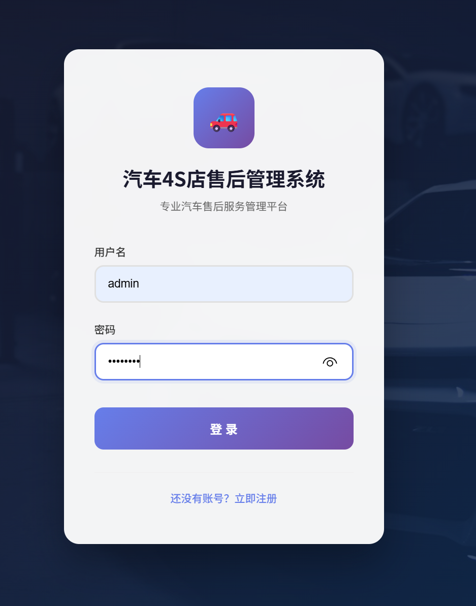
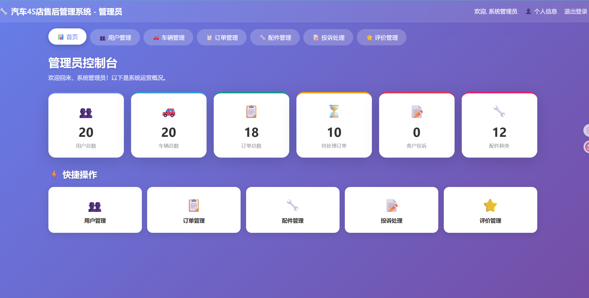
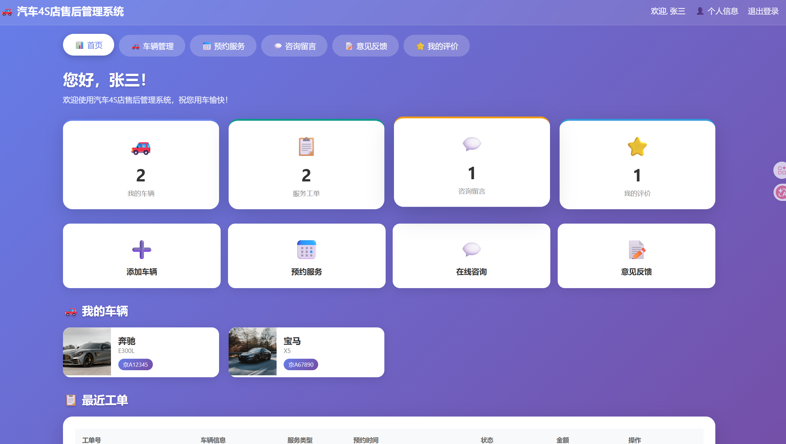
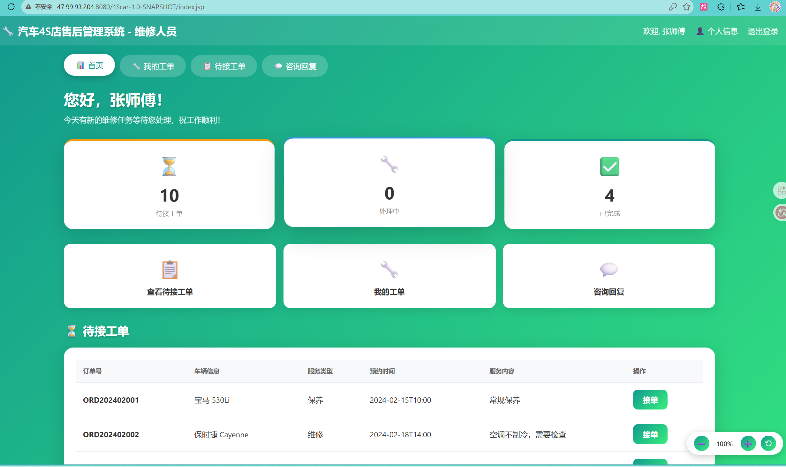
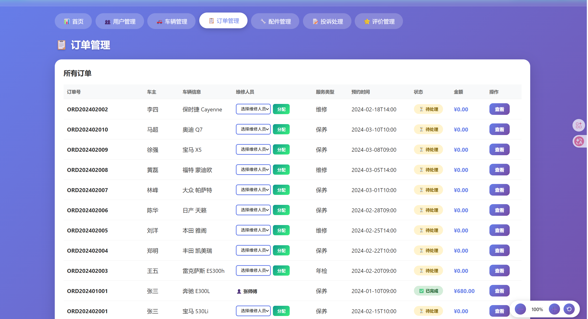

# 🚗 4Scar — 汽车4S店售后管理系统

[](http://47.99.93.204:8080)
[](https://github.com/LuckyDogHwk/4Scar)
[](https://www.oracle.com/java/)
[](https://tomcat.apache.org/)
[](LICENSE)

一个基于 Java Web 的汽车4S店售后管理系统，支持管理员、维修人员、车主三种角色，覆盖车辆管理、预约服务、工单流转、配件库存、投诉评价等完整业务闭环。项目已**部署至阿里云服务器**并稳定运行。

---

## 📖 项目介绍

4Scar 实现了一个完整的汽车4S店售后服务管理平台：

| 角色 | 核心职责 |
|------|---------|
| **管理员** | 用户管理、配件管理、数据统计、投诉处理 |
| **维修师傅** | 抢单派单、处理订单、回复车主留言 |
| **车主** | 车辆管理、预约服务、投诉评价、在线留言 |

---

## ✨ 功能特性

### 管理员
- 用户管理（添加、编辑、删除用户，三端权限隔离）
- 车辆信息查看与统计
- 服务订单全流程管理
- 配件库存管理（含库存预警）
- 投诉处理（闭环流转）
- 首页数据统计看板

### 维修师傅
- 待处理订单列表与抢单
- 服务订单处理（processing → completed）
- 回复车主留言
- 个人信息管理

### 车主
- 车辆管理（多车支持，唯一性校验）
- 预约服务（支持派单/抢单两种模式）
- 订单状态实时查看
- 在线留言与咨询
- 投诉提交
- 1-5 星服务评价
- 个人信息管理

---

## 🔧 技术栈

| 类别 | 技术 |
|------|------|
| 开发语言 | Java 21 |
| Web 框架 | Jakarta Servlet 6.0 + JSP + JSTL |
| 数据库 | MySQL 8.x |
| 连接池 | Alibaba Druid（含 SQL 监控） |
| ORM 工具 | Apache Commons DbUtils |
| JSON | Jackson |
| 日志 | SLF4J + Logback（控制台 + 文件滚动） |
| 简化开发 | Lombok |
| 构建工具 | Maven |
| 运行容器 | Apache Tomcat 11 |
| 部署平台 | 阿里云 ECS |

---

## 🌟 技术亮点

- **自定义 ORM 映射**：基于 DbUtils 扩展 `CustomBeanProcessor`，实现数据库字段下划线自动转驼峰及 `LocalDateTime` 类型自动映射
- **MD5 密码加密**：所有用户密码采用 MD5 加密存储，提升安全性
- **MVC 三层架构**：严格 `Servlet → Service → DAO` 分层设计，职责清晰
- **多角色权限隔离**：基于 Session + Filter 实现三端独立界面与角色级权限控制
- **Druid 连接池优化**：数据库连接复用 + SQL 执行监控，保障性能
- **全局异常处理**：统一异常拦截与日志记录，保证系统稳定性
- **Lombok 简化开发**：实体类零样板代码，项目代码量减少约 40%

---

## 📁 项目结构

```
4Scar/
├── src/main/java/com/car4s/
│   ├── entity/              # 实体类（Lombok 简化）
│   │   ├── User.java
│   │   ├── Car.java
│   │   ├── ServiceOrder.java
│   │   ├── Part.java
│   │   ├── Review.java
│   │   ├── Message.java
│   │   └── Complaint.java
│   ├── dao/                 # 数据访问层
│   │   └── UserDao.java
│   ├── service/             # 业务逻辑层
│   │   ├── UserService.java
│   │   ├── CarService.java
│   │   ├── ServiceOrderService.java
│   │   ├── PartService.java
│   │   ├── ReviewService.java
│   │   ├── MessageService.java
│   │   └── ComplaintService.java
│   ├── servlet/             # 控制层（Servlet）
│   │   ├── AuthServlet.java
│   │   ├── IndexServlet.java
│   │   ├── CarServlet.java
│   │   ├── ServiceOrderServlet.java
│   │   ├── PartServlet.java
│   │   ├── ReviewServlet.java
│   │   ├── MessageServlet.java
│   │   ├── ComplaintServlet.java
│   │   └── UserServlet.java
│   ├── filter/              # 过滤器
│   │   └── GlobalExceptionFilter.java
│   └── util/                # 工具类
│       ├── DBUtil.java          # Druid 数据库连接工具
│       ├── MD5Util.java         # MD5 加密工具
│       ├── Result.java          # 统一响应结果封装
│       ├── PageBean.java        # 分页结果封装
│       ├── CustomBeanProcessor.java  # 自定义字段映射
│       ├── CustomBeanHandler.java
│       └── CustomBeanListHandler.java
├── src/main/resources/
│   ├── druid.properties     # 数据库连接配置
│   ├── logback.xml          # 日志配置
│   └── sql/init.sql         # 数据库初始化脚本
├── src/main/webapp/
│   ├── admin/               # 管理员端页面
│   ├── mechanic/            # 维修师傅端页面
│   ├── owner/               # 车主端页面
│   ├── login.jsp
│   ├── register.jsp
│   └── index.jsp
└── pom.xml
```

---

## 🚀 快速开始

### 环境要求

- JDK 21+
- Maven 3.6+
- MySQL 8.0+
- Tomcat 11

### 步骤

#### 1. 克隆项目
```bash
git clone https://github.com/LuckyDogHwk/4Scar.git
cd 4Scar
```

#### 2. 初始化数据库
```sql
CREATE DATABASE car_4s CHARACTER SET utf8mb4 COLLATE utf8mb4_unicode_ci;
```
然后执行 `src/main/resources/sql/init.sql` 初始化表结构和测试数据。

#### 3. 修改数据库连接
编辑 `src/main/resources/druid.properties`：
```properties
driverClassName=com.mysql.cj.jdbc.Driver
url=jdbc:mysql://你的数据库地址:3306/car_4s?useSSL=false&serverTimezone=Asia/Shanghai&characterEncoding=UTF-8&allowPublicKeyRetrieval=true
username=你的用户名
password=你的密码
```

#### 4. 构建并部署
```bash
mvn clean package -DskipTests
```
将 `target/4Scar-1.0-SNAPSHOT.war` 复制到 Tomcat 的 `webapps` 目录，启动 Tomcat。

#### 5. 访问系统
打开浏览器访问 `http://localhost:8080/4Scar-1.0-SNAPSHOT`

---

## 🔑 测试账号

| 角色 | 用户名 | 密码 |
|------|--------|------|
| 管理员 | admin | admin123 |
| 维修师傅 | mechanic1 | 123456 |
| 维修师傅 | mechanic2 | 123456 |
| 维修师傅 | mechanic3 | 123456 |
| 车主 | owner1 | 123456 |
| 车主 | owner2 | 123456 |

---

## 📸 系统截图

> 截图文件请存放于 `screenshots/` 目录

### 登录页面


### 管理员首页


### 车主首页


### 维修师傅首页


### 订单管理


---

## 🗄️ 数据库设计

| 表名 | 说明 |
|------|------|
| `user` | 用户表（管理员、维修师傅、车主） |
| `car` | 车辆信息表 |
| `service_order` | 服务订单表 |
| `part` | 配件表 |
| `review` | 评价表 |
| `message` | 留言表 |
| `complaint` | 投诉表 |

**实体关系：**
```
user ──1:N──> car
user ──1:N──> service_order
car  ──1:N──> service_order
service_order ──1:1──> review
user ──1:N──> message
user ──1:N──> complaint
service_order ──1:1──> complaint
```

---

## 🛠️ 日志管理

项目使用 SLF4J + Logback 进行日志管理：
- **控制台输出**：实时查看 DEBUG 级别以上的日志
- **文件滚动**：自动按天切割，保留 30 天历史
- **日志路径**：`logs/4scar.log`

日志级别可在 `src/main/resources/logback.xml` 中调整。

---

## 📝 更新日志

### v1.0.0 (2026-05-31)
- 完成基础功能开发
- 支持三种角色权限隔离
- 实现车辆管理、订单流转、配件库存、投诉评价等完整业务闭环
- 集成 SLF4J + Logback 日志系统
- 集成 MD5 密码加密
- 全局异常处理
- 实体类 Lombok 优化
- 阿里云服务器部署

---

## 👨‍💻 作者

- GitHub: [@LuckyDogHwk](https://github.com/LuckyDogHwk)
- 在线演示: [http://47.99.93.204:8080](http://47.99.93.204:8080)

---

## 📄 许可证

本项目采用 MIT 许可证

---

⭐ **如果这个项目对你有帮助，欢迎 Star！**
